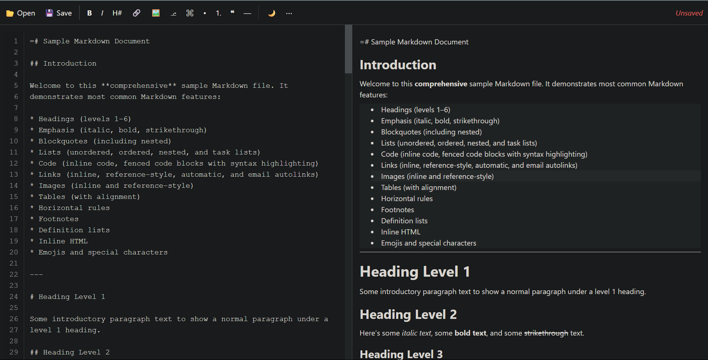

# MarkdownEditor

SvelteKit‑based web app for live Markdown editing and previewing.

[](https://markdown-editor-iota-seven.vercel.app/)	[](#)

[View Live Demo](https://markdown-editor-iota-seven.vercel.app/)



---
## Installation & Setup

Clone the repository and install:
```bash
git clone <repo-url>
cd markdown-editor
npm install
```

Start the development server:
```bash
npm run dev
```

## Usage Tips

- Your work is automatically saved to `localStorage` on every change. Reloading
  the page will offer to restore the previous session.
- Use the **Download** button (⌘‑S) in the toolbar to save the current document
  as a `.md` file. When supported, the native File System API is used.
- A small *Unsaved* indicator appears in the toolbar whenever edits have not yet
  been downloaded.
